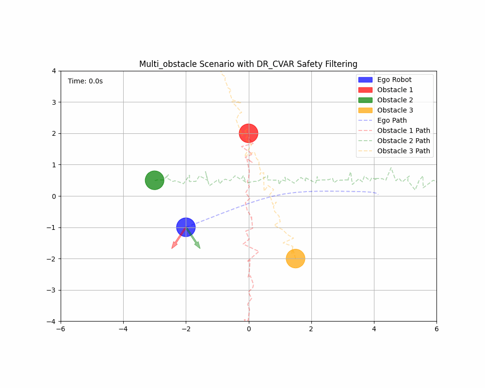
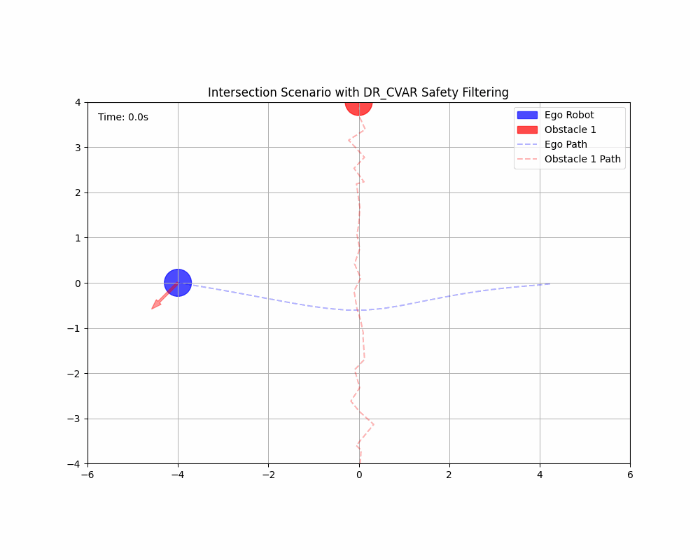
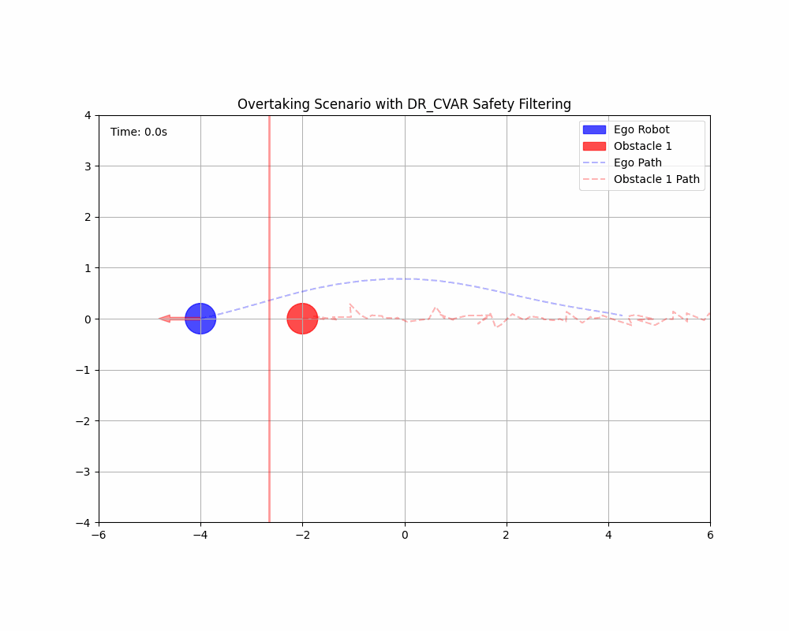
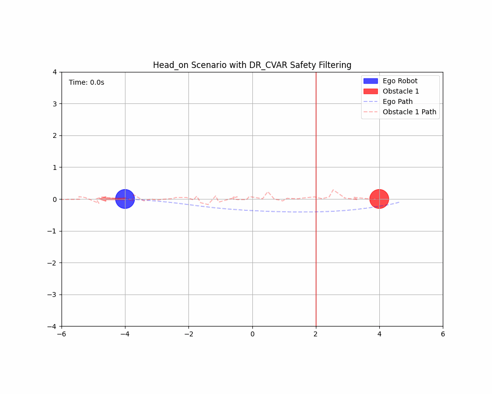
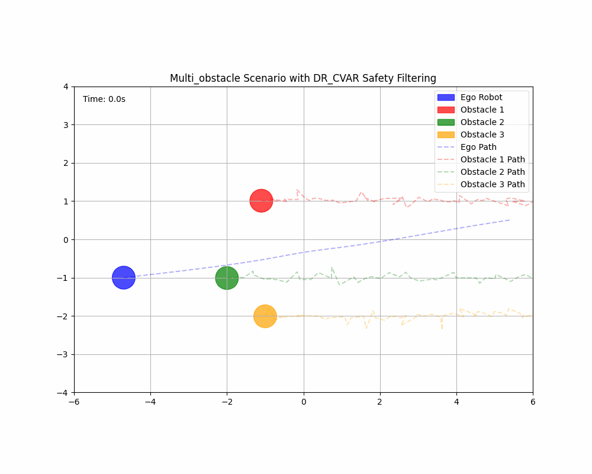
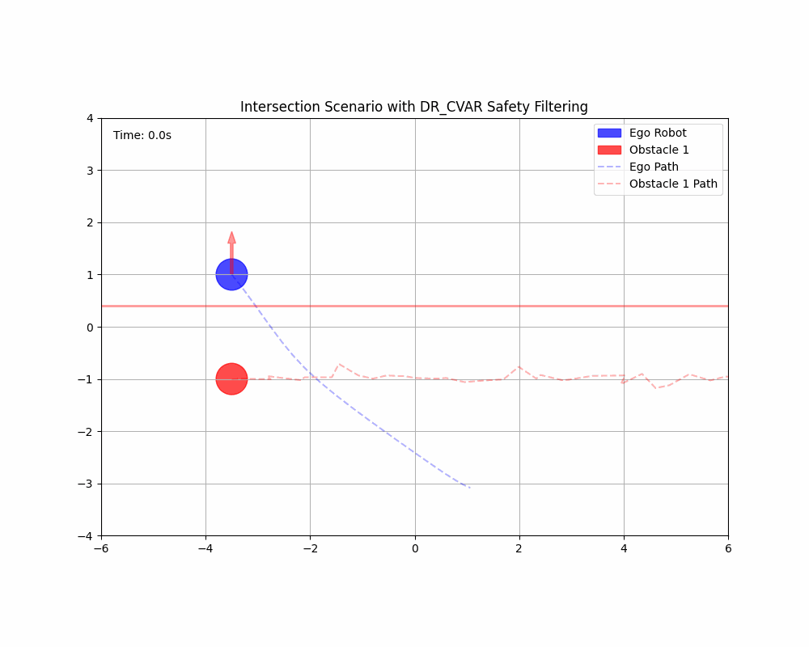
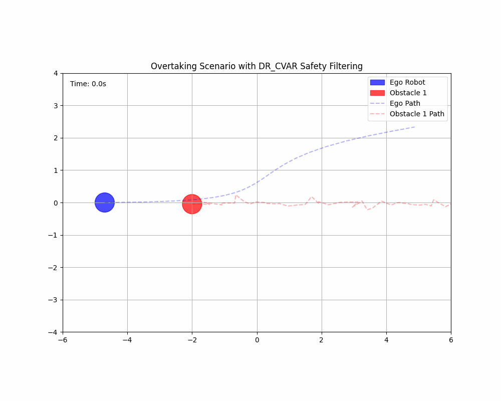
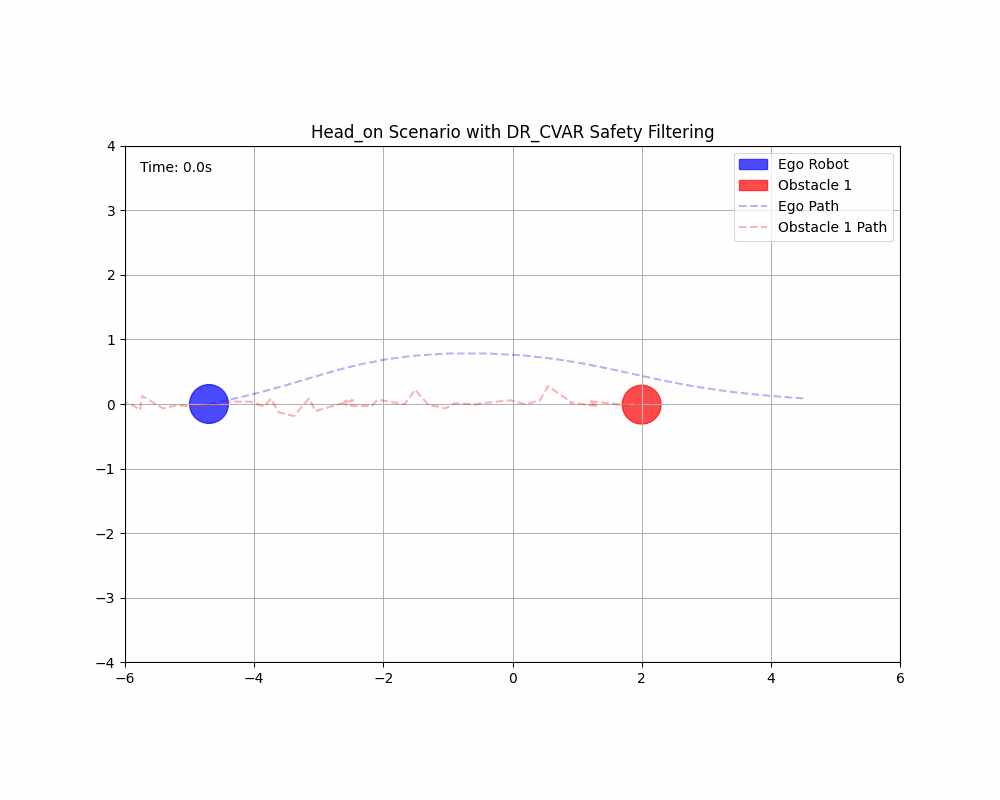

# Distributionally Robust Conditional Value at Risk-based Safety Filtering for Motion Planning in Uncertain Environments

This repository provides a custom implementation of the ICRA 2024 research paper titled "Distributionally Robust CVaR-Based Safety Filtering for Motion Planning in Uncertain Environments." This has been created from scratch by reading the paper and is an attempt to replicate some of the experiments in the orginal paper. 

Link to the paper: https://arxiv.org/pdf/2309.08821

Link to the official implementation of the paper: https://github.com/TSummersLab/dr-cvar-safety_filtering

## ⚙️ Setup Instructions

Follow these steps to clone the repository and set up the Conda environment:

### 1️⃣ Clone the Repository

```bash
git clone git@github.com:RJ-23YP/DR_CVaR_MPC_Safety_Filter_Motion_Planning_Collison_Avoidance.git
cd DR_CVaR_MPC_Safety_Filter_Motion_Planning_Collison_Avoidance
```

### 2️⃣ Create and Activate the Conda Environment

Make sure you have [Conda](https://docs.conda.io/en/latest/miniconda.html) installed. Then run:

```bash
conda env create -f environment.yml
conda activate dr_cvar_safety_filtering 
```

📦 This will install all required dependencies listed in the `environment.yml` file into a new conda environment named `dr_cvar_safety_filtering`.

---

💡 If you face any issues during setup, make sure your Conda installation is up to date and restart your terminal after creating the environment. Remember to source the conda environment everytime you want to activate it. 


## 🔧 How to Run the Code

This project provides a flexible simulation environment for testing safety filtering using DR-CVaR and other risk metrics. You can run predefined scenarios, generate visualizations, and perform timing analysis. Below are instructions for using the script via command line.

---

### 📁 Basic Command Structure

```bash
python main.py --scenario <scenario_name> --mode <mode> [--animate] [--metric <risk_metric>] [--sample_sizes <sizes>] [--timing_runs <n>]
```

---

### 🧪 Run a Single Scenario

Run a predefined scenario with optional animation.

```bash
python main.py --scenario head_on --mode single
```

With animation for a specific risk metric (default is `dr_cvar`):

```bash
python main.py --scenario head_on --mode single --animate --metric dr_cvar
```

Available `--scenario` options:
- `head_on`
- `overtaking`
- `intersection`
- `multi_obstacle`

Available `--metric` options:
- `mean`
- `cvar`
- `dr_cvar`

---

### ⏱️ Run Timing Analysis

Measure computation time of DR-CVaR filtering for various sample sizes.

```bash
python main.py --mode timing_analysis --sample_sizes 10,50,100,500,1000,1500 --timing_runs 50
```

Customize sample sizes or number of runs:

```bash
python main.py --mode timing_analysis --sample_sizes 100,500,1000 --timing_runs 20
```

---

### 📂 Output

- Results are saved in the `results/` directory.
- Plots and animations are named according to the scenario and risk metric.

---

### 📝 Notes

- Set a fixed seed for reproducibility (`np.random.seed(42)` is used).
- Ensure all required modules are installed before running (e.g., `matplotlib`, `numpy`).


## 🚗 Collision Avoidance Trajectory

This section showcases the output of the DR-CVaR safety filtering algorithm applied to different motion planning scenarios. The GIFs below illustrate how the ego vehicle navigates around obstacles under various configurations.

---

### 🔧 Custom Scenarios

<div align="center">
  <table>
    <tr>
      <td></td>
      <td></td>
    </tr>
    <tr>
      <td></td>
      <td></td>
    </tr>
  </table>
</div>

---

### 📄 Paper Scenarios

<div align="center">
  <table>
    <tr>
      <td></td>
      <td></td>
    </tr>
    <tr>
      <td></td>
      <td></td>
    </tr>
  </table>
</div>

